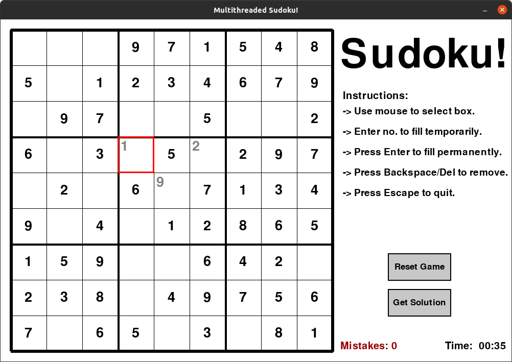

Multi Threaded Sudoku Solver

Note:

PyGame is required to run the packaged distribution.

Functions:

- Press any number key to fill a box
- Press enter on a filled box to confirm it
- Use the solution button to get the solution of the displayed puzzle
- Reset to start a new game

Tech Used:

- Python3
- PyGame
- AC3 Backtracking Algorithm
